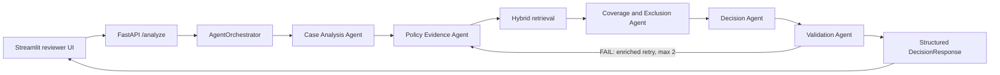

# Architecture Note

## Purpose and design goals

The Policy-Aware Multi-Agent RAG Claim Decision Engine evaluates a synthetic health-insurance claim against the supplied policy wording. The policy is the authority for coverage decisions. The system is designed to be auditable: decisions expose structured findings, policy citations, validation status, and a concise execution trace without exposing hidden chain-of-thought.

The main reliability goals are:

- investigate multiple policy dimensions instead of relying on one broad query;
- keep agent communication typed and inspectable;
- abstain as `NEEDS_REVIEW` when required facts or policy support are missing; and
- make retrieval and citation quality measurable independently from decision accuracy.

## System boundary and flow

The API accepts one `ClaimCase` inside an `AnalysisRequest`. The orchestrator runs the agents in sequence and returns a `DecisionResponse`. The frontend can call the API or use the same orchestrator in-process when the API is unavailable.

## Agent boundaries and state contracts

### Case Analysis Agent

Extracts normalized facts from the claim, identifies relevant decision dimensions, records missing fields, and creates an investigation plan. Its output is `CaseState`, containing the original typed `ClaimCase`, extracted facts, dimensions, and missing fields.

### Policy Evidence Agent

Converts each investigation dimension into focused policy queries. It runs the hybrid search for each dimension, deduplicates the results, and returns `EvidenceState`. Evidence retains chunk ID, page, section, heading, scores, and rank so downstream findings can cite the source policy.

### Coverage and Exclusion Agent

Evaluates the evidence and extracted facts against deterministic policy rules. It handles hospitalization scope, waiting periods, pre-existing conditions, exclusions, day-care and domiciliary treatment, sub-limits, ambulance limits, pre/post-hospitalization windows, hospital eligibility, and portability. It returns structured `CoverageFindings` with statuses, assessments, applicable limits, and policy chunk IDs.

### Decision Agent

Maps specialist findings into one of the contract statuses: `ADMISSIBLE`, `ADMISSIBLE_WITH_LIMITS`, `PARTIALLY_ADMISSIBLE`, `NOT_ADMISSIBLE`, or `NEEDS_REVIEW`. It also checks critical document gaps, builds missing-evidence messages, and assigns a bounded confidence score. It does not invent a payable amount when a required condition cannot be established.

### Validation Agent

Checks that generated citation claims overlap sufficiently with the text of the cited retrieved chunks. A failed validation causes up to two enriched retrieval passes. If validation still fails, the orchestrator downgrades the result to `NEEDS_REVIEW` and lowers confidence rather than returning an unsupported confident decision.

All intermediate objects are Pydantic models defined in `backend/src/models/schemas.py`. The trace contains agent names, actions, details, and elapsed times only.

## Ingestion and retrieval

The supplied policy PDF is parsed page by page with `pypdf`. Chunking follows detected policy sections and sentence boundaries, with overlap between adjacent chunks. Every chunk stores a stable ID, page, section, heading, text, and length metadata. The generated JSON index and raw page extraction are kept under `backend/data/policy/`.

Retrieval combines three stages:

1. **Dense retrieval:** `BAAI/bge-small-en-v1.5` embeddings are compared with cosine similarity.
2. **Sparse retrieval:** BM25 matches exact policy vocabulary and clause terms.
3. **Fusion and reranking:** dense and sparse ranked lists are combined using Reciprocal Rank Fusion, then candidates are reranked with `ms-marco-MiniLM-L-6-v2`.

The evidence agent performs focused searches per decision dimension rather than treating the whole case as one query. Search results retain dense, sparse, fused/rerank, and final rank metadata. This supports retrieval diagnostics and citation recall evaluation.

## Decision and validation trade-offs

The default decision path is deterministic. Numeric policy rules are extracted from retrieved text and applied by Python rule logic, while an optional LLM provider is used for query refinement only. This keeps evaluation reproducible and prevents an LLM from silently overriding policy rules. The trade-off is narrower coverage of unusual clauses than a fully generative approach.

Citations are selected from coverage findings and limited to keep responses readable. The evaluation therefore measures both decision accuracy and curated citation recall. The current report achieves 17/17 expected decision labels and 100% validation pass rate, while mean curated citation recall is 38.2%. That gap is intentional to expose evidence-quality limitations rather than hide them behind the decision score.

The system has two abstention safeguards: missing case/document evidence produces `NEEDS_REVIEW`, and unsupported citation claims trigger validation retries followed by a conservative downgrade. This favors review over an ungrounded denial or admission.

## Evaluation and operations

`backend/src/evaluation/run_evaluation.py` runs all 12 public cases and 5 candidate-created cases. It reports exact decision accuracy, validation pass rate, citation recall against curated gold chunks, citation coverage, confidence, latency, confusion matrix, and per-case details under `backend/output/`.

The backend exposes `GET /health` and `POST /analyze`. Local deployment uses Uvicorn for the API and Streamlit for the UI. Docker Compose starts the API on port 8000 and the frontend on port 8501. LLM credentials are supplied through environment variables; the application works without credentials using the deterministic fallback.

## Known limitations

- Curated gold chunks are a useful proxy, not a complete proof of citation correctness.
- Citation capacity and per-finding selection reduce recall for cases with many competing dimensions.
- Rule extraction covers the policy sections currently implemented; obscure clauses may be retrieved without a dedicated rule.
- The local Docker configuration is reproducible, but a public hosted URL must be supplied separately for an external submission.
